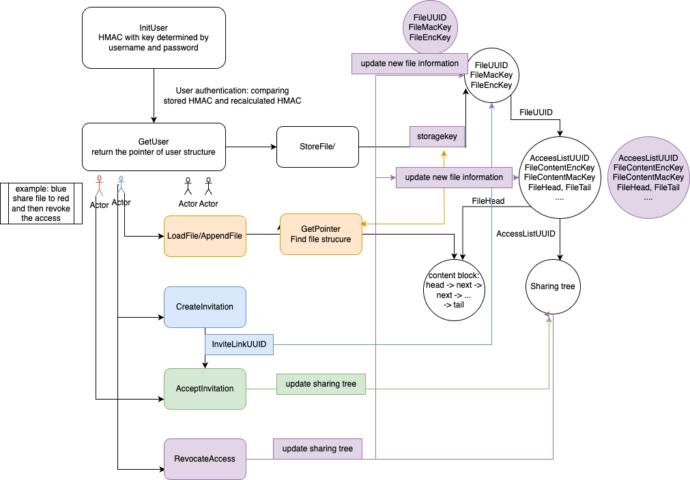

# Design Document

## DataStorage
*format explain: 
    DataStore[id] = val <=> DatatStore{ id -> val}*
- KeyStore
```
{
    // UserEncKey, UserDecKey : PKEKeyGen 
    // DSSignKey, DSVerifyKey : DSKeyGen
    Username + "1" -> UserEncKey1 
    Username + "2" -> UserEncKey2 
    Username + "3" -> DsVerifyKey 
}
```
KeyStore stores public public encryption/verification keys. `UserEncKey1` is used for encrypting invitation sent by the user. `UserEncKey2` is used for encrypting the fileUUID of the user's file. `DsVerifKey` is to verify the signature of a certain user.
- DataStore
  
*explain: XToByte means marsh X structure to byte format*
```
{
    // UserUUID: uuid.FromBytes(userlib.Argon2Key([]byte(username), []byte(""), 16))
    // userEncSK: Argon2Key([]byte(password), []byte(username), 16)
	// userMacKey:= HashKDF(userEncSK, []byte("regenerate"))
    UserUUID -> HMACEval(userMacKey, userEnc) || Enc(UserToByte, UserEncSK)    
    
    // storagekey is generated from username and filename
    storagekey -> HMACK(UserEncKey2, PKEEnc(UserEncKey2， FileEncKey || FileMacKey || FileUUID)) || PKEEnc(UserEncKey2, FileEncKey || FileMacKey || FileUUID)
    
    // FileEncKey, FileMacKey are randomly generated
    FileUUID -> HMACK(FileMacKey, Enc(FileToByte, FileEncKey)) || Enc(FileToByte, FileEncKey)
    
    // FileContentEncKey, FileContentMacKey are generated from FileEncKey, FileMacKey
    AccessListUUID -> HMAC(FileContentMacKey, Enc(ccessListToByte, FileContentEncKey)) || Enc(AccessListToByte, FileContentEncKey) 

    InviteLinkUUID -> DDSign(msg:{Enc(InviteLinkToByte, Receiver_UserEncKey1)},  key:{DDsignKey})

    // FileContentToByte contains next block pointer, actually stores in a link list structure
    FileHead -> HMAC(FileContentMacKey, Enc(FileContentToByte, FileContentEncKey)) || Enc(FileContentToByte, FileContentEncKey) 
    
}
```
## Data Structure 
    - User Structure
    ```
    type User struct {
        // Stored in Mac||Enc format, symmetric encryption, keys are determined by username + password
        Username    string
        SignKey     userlib.DSSignKey
        UserDecKey1 userlib.PKEDecKey
        UserDecKey2 userlib.PKEDecKey
    }
    ```
    - File Structure
    ```
    type File struct {
        // Stored in Mac||Enc format, symmetric encryption, using keys: FileEncKey, FileMacKey
    	Creator           string
    	FileLength        int
    	FileHead          userlib.UUID
    	FileTail          userlib.UUID
    	FileContentEncKey []byte
    	FileContentMacKey []byte
    	AccessListUUID    userlib.UUID
    }
    ```
    - InvireLink Structure
    ```
    type InviteLink struct { 
        // Stored in {Enc}sign format, public key encryption
    	FileUUID   userlib.UUID
    	FileEncKey []byte
    	FileMacKey []byte
    	UUIDSrc    []byte // Used to generate FileUUID
    }
    ```
    - AccessList Structure
    ```
    type AccessList struct { 
        // Stored in MAC||Enc format, symmetric encryption, using keys: FileContentEncKey, FileContentMacKey
        Username string
    	Filename string
    	Edge     []Edge
    }
    ```
    - Edge Structure
    ```
    type Edge struct {
    	Sender   string
    	Receiver string
    	Filename string
    }
    ```
    - FileContent Structure 
    ```
    type FileContent struct {
        // Stored in MAC||Enc format, symmetric encryption,using keys: FileContentEncKey, FileContentMacKey
    	EncBlock []byte 
    	NxtBlock *FileContent
    }
    ```
## Diagram
 

## Design
- User Authentication
  - Username Uniqueness: When creating a user, check whether the username exists in the Keystore as a key or not.
  - Password Verification: We check whether the (username, password) pairs match by following steps:
    - Calculate Useruuid given username.
    - Use Useruuid to find HMAC value in the Datastore
    - Compare the recalculated HMAC value generated from the given username and password with the stored HMAC value. (Since key of HMAC is determined by username + password, only right match can give the same HMAC value)
  - Multiple user session: GetUser function calls return the pointer to the user structure instead of an instance of a user structure. So all sessions are modifying at the same address.
- **Most important logic to understand file system**  
    - User can find `FileUUID` in DataStore[storagekey], where storage key is determined by username and how he name the file. Finding `FileUUID` needs constant time.
    - `FileUUID` stores information about the file, **not the content of file**.
    - `FileHead` in file information pointers to where file content is actually stored in a link list structure
    - AccessList itself is not a tree but stores all edges of the sharing tree. We can use these edges to construct a sharing tree.
- File Storage and Retrieval
  
  - File Storage procedure:
    - Calculate `storageKey` with filename and username
    - Generate `FileUUID`, `FileMacKey`, `FileEncKey` by RandomByte generator
    - Encrypt then Mac `FileUUID`, `FileMacKey`, `FileEncKey` and store them to DataStore[storageKey]
    - Split content by fixed-length block; encrypt and then mac each block. `FileContentEncKey`, `FileContentMacKey` is stored in file structure
    - Store file content block by a link list structure; track its `head`, `tail` in file structure
    - **Special case**: if filename already exits in user's file namespace, just overwrite filecontent and update file information.
    - Store file structure in DataStore[FileUUID]
  - File Retrieval procedure
    - Calculate `storageKey` with filename and username and use it to find `FileUUID`, `FileMacKey`, `FileEncKey`
    - Use `FileHead` to find the address of filecontent, and trasver the link list. For each block, first verify its integrity by comparing stored Mac and recalculated Mac. Then decrypt the blocsk and put them together
  - Efficient Append
    The file is split into several fixed-length byte blocks. Blocks are stored in link list with next pointer. To append a message at the end of the file, the user only needs to retrieve `FileTail` to find the last block and extend the link list. To find `FileUUID` and `FileTail` only constant time. User and file structure will not grow with the number of file number. So this will guarantee that the AppendToFile operation scale linearly with only the size of data being appended.


- File Sharing: 
  - Create Invitation:
        A user shares a file by creating a `InviteLink`. The sender encrypts the `InviteLink` with the public key of the receiver. The sender authenticates the message using a signature. Then sender send `InviteLinkUUID` to receiver.
  - Accept Inviation:
    - Receiver receives `InviteLinkUUID` through a secure channel. Receiver verifies the signaure and decrypt`InviteLink` using his private key. The `InviteLink` contents `FileUUID`, `FileMacKey`, `FileEncKey` for receiver to get the position and value of file. Then receiver stores these information in DataStore[storagekey]. 
    - Update the `AccessList` of the file by adding an edge {sender, receiver, filename}
- File Revocation
   
   The revoke process takes the following steps:
  - Check whether the revoke request is valid.
  - Delete corresponding edges in `AccessList`. The `AccessList` stores all sharing information by edges. We can perform a tree traverse on it and delete all information in the subtree of the directly revoted user.
  - The server uses newly generated `FileMacKey`, `FileEncKey` to encrypt and Mac the file, newly generated `FileContentMacKey`, `FileContentEncKey` to encrypt and Mac the file content and new accessList. New file, file content, accessList will be moved to new place with newly generated `FileUUID`, `FileHead`, `AccessListUUID`.
  - The server tracks users still in `AccessList` and update their DataStore[storagekey]. 
  - **Special situation**: if sender revokes  a receiver who has receive the inivitation, just delete the invitation.


- Helper Methods
    - EncFile: encrypt and mac file content by blocks
    - ByteCombine: concatenate server `[]byte` together
    - LongPKEEnc, LongPKEDec: split long plaintext into blocks and encrypt/decrypt them with `PKEEnc/PKEDec`, then concatenate them together
    - getPointer: provide filename and user pointer; return file, FileUUID, FileEncKey, FileMacKey. Called in many file functions.
    - GetAccessList: get the accesslist of a certain file
    - DeleAccessList: in revocation, delete all revocated users infomation in the accesslist  
    - UpdateInfo: in revocation, for non-revocated users, replace their old file with new file
